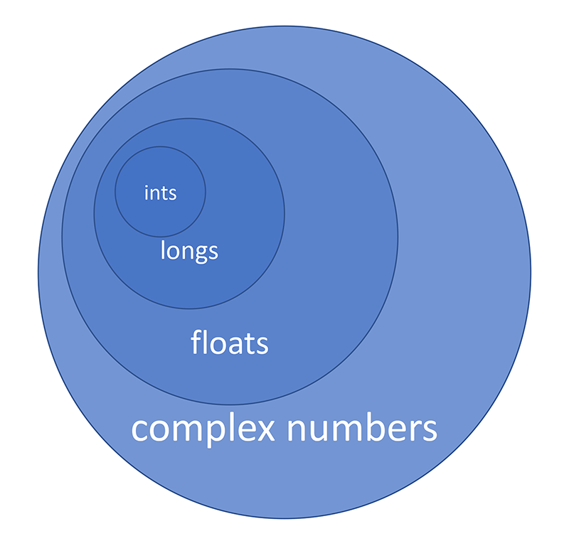

---
title:
- Python Basics 1

author:
- Jie Niu

date:
- 2020-1-7

theme:
- CambridgeUS

---
# Hello Python

## Install Python

[https://www.python.org](https://www.python.org)  
&nbsp;
&nbsp;
&nbsp;

Anaconda (includes everything you need for scientific computing) [https://www.anaconda.com](https://www.anaconda.com)

## Start using Python interpreter

Open **terminal** (Mac OS or Linux)

```bash
$ python
```

or **cmd** (Windows)

```bash
C:\> python
```

```bash
$ python

Python 2.x.xx ...
...

>>>
```

## Start using Python interpreter

```bash
$ python3

Python 3.x.xx ...
...

>>>
```

```bash
>>> print('Hello Python!')
Hello Python!
>>>
```

## Write your first Python script file

Using any of your favorite Text Editor.

```bash
$ vim 01_hello_python.py
```

Input `print("Hello Python!")` in your file.

```bash
$ python 01_hello_python.py
Hello Python!

$
```

# Python Strings

## Single or Double Quote

```bash
$ python

Python 3.x.xx ...
...

>>> message = 'Meet me tonight.'
>>> print(message)
Meet me tonight.
>>>
>>> message2 = "The clock strikes at midnight."
>>> print(message2)
The clock strikes at midnight.
>>>
```

## Mixed Quotes

```bash
>>> message3 = 'I'm looking for someone to ...'
... ...
SyntaxError: invalid syntax
>>> message3 = 'I\'m looking for someone to ...'
>>> message3 = "I'm looking for someone to ..."
>>> message4 = "The word "apple" was not ..."
... ...
SyntaxError: invalid syntax
>>>
>>> message4 = 'The word "apple" was not ...'
>>>
```

## Triple Quote

```bash
>>> complex_string = """no matter you have
... "double quote", or
... 'single quote', or multiple lines,
... this triple quote can handle."""
>>>
```

# Numbers in Python

## Numbers in Python Version 2

```bash
$ python

Python 2.x.xx ...
...

>>> # Types of numbers: int, long, float, complex
... # Whole numbers: int, long
...
>>> a = 28  # This is an integer
>>> type(a)
<type 'int'>
>>> a
28
>>> print(a)
28
>>>
```

## Numbers in Python Version 2

```bash
>>> import sys
>>> sys.maxint
2147483647
>>> b = 2147483647
>>> type(b)
<type 'int'>
>>> c = 2147483648
>>> type(c)
<type 'long'>
>>> c
2147483648L
>>> print(c)
2147483648
>>>
```

## Numbers in Python Version 2

```bash
>>> d = -sys.maxint - 1
>>> type(d)
<type 'int'>
>>> d
-2147483648
>>> e = -2147483649
>>> type(e)
<type 'long'>
>>>
>>> f = 1L
>>>
```

## Numbers in Python Version 2

### Floats

```bash
>>> e = 2.718281828
>>> type(e)
<type 'float'>
>>>
```

### Complex Numbers

```bash
>>> z = 3 + 5.7j
>>> type(z)
<type 'complex'>
>>> z.real
3.0
>>> z.imag
5.7
>>>
```

## Numbers in Python Version 3

```bash
$ python3
Python 3.x.xx ...
...
>>> # Types of numbers: int, float, complex
...
>>> a = 496  # This is an integer
>>> type(a)
<class 'int'>
>>> a
496
>>> print(a)
496
>>>
```

In Python3, as large as your computer memory, you can create any integer numbers, no worry about the overflow and the underflow.

## Numbers in Python Version 3

### Floats

```bash
>>> e = 2.718281828
>>> type(e)
<class 'float'>
>>>
```

### Complex Numbers

```bash
>>> z = 2 - 6.1j
>>> type(z)
<class 'complex'>
>>> z.real
2.0
>>> z.imag
6.1
>>>
```

# Arithmetic in Python

## Arithmetic in Python V2

```bash
$ python
Python 2.x.xx ...
...
>>> # Numbers: int, long, float, complex
... # Operations: + - * /
...
>>> x = 5  # int
>>> y = 5L  # long
>>> long(5)
5L
>>> 10000000000
10000000000L
>>> # ints are narrower than longs
... # longs are wider than ints
```

## Arithmetic in Python V2

```bash
>>> x = 28L  # long
>>> y = 28.0  # float
>>> float(28)
28.0
>>> 3.14  # float
3.14
>>> long(3.14)
3
>>> 3L
>>> # longs are narrower than floats
... # floats are wider than longs
>>>
```

## Arithmetic in Python V2

```bash
>>> x = 1.732  # float
>>> 1.732 + 0j
(1.732+0j)
>>> complex(1.732)
(1.732+0j)
>>> float(1.732 + 0j)
......
TypeError: can not convert complex to float
>>>
>>> # floats are narrower than complex numbers
... # complex numbers are wider than floats
```

## Arithmetic in Python V2



## Arithmetic Operations

```bash
>>> a = 2  # int
>>> b = 3L  # long
>>> c = 6.0  # float
>>> d = 12 + 0j  # complex number
>>> # Rule: Widen numbers so they are the same type
>>> a + b  # Addition: int + long
5L
>>> c - b  # Subtraction: float - long
3.0
>>> a * c  # Multiplication: int * float
12.0
>>> d / c  # Division: complex / float
(2+0j)
```

## Arithmetic Operations

### Integer Division

```bash
>>> 16 / 5
3
>>> 16 % 5
1
>>> float(16) / 5
3.2
>>> 16 / float(5)
3.2
>>> 2 / 0
......
ZeroDivisionError: integer division or modulo by zero
```

## Arithmetic in Python V3

```bash
$ python3
Python 3.x.xx ...
...
>>> # Numbers: int, float, complex number
>>> # Operations: + - * /
...
>>> 16 / 5  # NOTE: Different than Python 2!!!
3.2
>>> 20 / 5
4.0
>>> 16 % 5
1
>>> 16 // 5  # NOTE: double //
3
>>>
```

# Interactive Help

## dir() and help()

```bash
>>> dir()  # short for 'directory'
['__builtins__', '__doc__', '__name__', '__package__']
>>> dir(__builtins__)
... ...
>>> help(pow)
... ...
>>> pow(2, 10)
1024
>>> 2 ** 10
1024
>>> help(hex)
... ...
>>> hex(10)
'0xa'
>>> 0xa
10
```

## List of Modules

```bash
>>> help(modules)  # results omitted
>>> import math
>>> dir()
['__builtins__', ... ... , 'math']
>>> dir(math)  # results omitted
>>> help(radians)
... ...
NameError: name 'radians' is not defined
>>> help(math.radians)  # results omitted
>>> radians(180)
... ...
NameError: name 'radians' is not defined
>>> math.radians(180)
3.141592653589793
>>>
```

# Python Booleans

## Booleans

```bash
>>> # Boolean values: True & False
>>> True
True
>>> true
... ...
NameError: name 'true' is not defined
>>> False
False
>>> false
... ...
NameError: name 'false' is not defined
```

## Booleans

```bash
>>> # '=', '==', '!=', '>', '<'
>>> a = 3
>>> b = 5
>>> a == b
False
>>> a != b
True
>>> a > b
False
>>> a < b
True
>>>
```

## Booleans

```bash
>>> type(True)  # <type 'bool'> in Python 2
<class 'bool'>
>>> type(False)
<class 'bool'>
>>> bool(28)
True
>>> bool(-2.71828)
True
>>> bool(0)
False
>>> # NOTE: in python, only number 0 converts to False
```

## Booleans

```bash
>>> bool("Turing")
True
>>> bool(" ")  # NOTE the blank space in the middle
True
>>> bool("")  # NOTE there is no blank space in the middle
False
>>> # NOTE: in python, only empty string converts to False
```

Booleans Conversions

+ trivial&nbsp;&nbsp;&nbsp;&nbsp;&nbsp;&nbsp;-->&nbsp;False
+ non-trivial&nbsp;-->&nbsp;True

## Booleans

```bash
>>> str(True)  # NOTE the result is a string, not a boolean
'True'
>>> str(False)
'False'
>>> int(True)
1
>>> int(False)
0
>>> 5 + True
6
>>> 10 * False
0
>>>
```

# Dates and Times

## Datetime Module

### Date

```bash
>>> import datetime
>>> dir(datetime)
... ...
>>> help(datetime.date)
... ...
>>> gvr = datetime.date(1956, 1, 31)
# Birthday of Guido van Rossum the creator of Python
>>> print(gvr)
1956-01-31
>>> print(gvr.year)
1956
>>> print(gvr.month)
1
>>> print(gvr.day)
31
```

## Datetime Module

### Date

```bash
>>> mill = datetime.date(2000, 1, 1)
>>> dt = datetime.timedelta(100)
>>> print(mill + dt)
2000-04-10
>>> # Default format: yyyy-mm-dd
>>> # Day-name, Month-name Day-#, Year
>>> print(gvr.strftime("%A, %B %d, %Y"))
Tuesday, January 31, 1956
>>> message = "GVR was born on {:%A, %B %d, %Y}."
>>> print(message.format(gvr))
GVR was born on Tuesday, January 31, 1956.
>>>
```

## Datetime Module

### time

```bash
>>> launch_date = datetime.date(2017, 3, 30)
>>> launch_time = datetime.time(22, 27, 0)
>>> launch_datetime = datetime.datetime(2017, 3, 30, 22, 27, 0)
>>> print(launch_date)
2017-03-30
>>> print(launch_time)
22:27:00
>>> print(launch_datetime)
2017-03-30 22:27:00
>>> print(launch_time.hour)
22
>>> print(launch_time.minute)
27
>>> print(launch_time.second)
0
```

## Datetime Module

### datetime

```bash
>>> print(launch_datetime.year)
2017
>>> print(launch_datetime.month)
3
>>> print(launch_datetime.day)
30
>>> print(launch_datetime.hour)
22
>>> print(launch_datetime.minute)
27
>>> print(launch_datetime.second)
0
>>>
```

## Datetime Module

### Access current datetime

-Module:&nbsp;datetime
-Class:&nbsp;&nbsp;&nbsp;&nbsp;datetime
-Method:&nbsp;today()
&nbsp;

```bash
>>> now = datetime.datetime.today()
>>> print(now)
2020-01-08 23:26:46.676595
>>> print(now.microsecond)
676595
>>>
```

## Datetime Module

### Convert Strings to Datetimes

-Module:&nbsp;datetime
-Class:&nbsp;&nbsp;&nbsp;&nbsp;datetime
-Method:&nbsp;strptime()

```bash
>>> moon_landing = "7/20/1969"
>>> moon_landing_datetime = datetime.datetime.strptime(
... moon_landing, "%m/%d%Y")
>>> print(moon_landing_datetime)
1969-07-20 00:00:00
>>> print(type(moon_landing_datetime))
<class 'datetime.datetime'>
>>>
```

# Control Flow in Python

## If, then, else

```bash
$ vim if_then.py
```

```python
# Collect string / test length

input = raw_input("Please enter a test string: ")

if len(input) < 6:  # Note the code block indentation
  print("Your string is too short.")
  print("Please enter a string with at least 6 characters.")
```

## If, then, else

```bash
$ python if_then.py
Please enter a test string: ace
Your string is too short.
Please enter a string with at least 6 characters.

$ python if_then.py
Please enter a test string: mission

$
```

## If, then, else

```bash
$ vim if_then_2.py
```

```python
# Prompt user to enter number / test if even or odd

input = raw_input("Please enter an integer: ")
number = int(input)

if number % 2 == 0:
  print("Your number is even.")
else:
  print("Your number is odd.")
```

## If, then, else

```bash
$ python if_then_2.py
Please enter an integer: 17
Your number is odd.

$ python if_then_2.py
Please enter an integer: 50
Your number is even.

$ python if_then_2.py
Please enter an integer: Mercury
Traceback (most recent call last):
  File "if_then_2.py", line 4, in <module>
    number = int(input)
ValueError: invalid literal for int() with base 10: 'Mercury'
```

## If, then, else

```bash
$ vim if_then_3.py
```

```python
# Scalene triangle: All sides have different lengths.
# Isosceles triangle: Two sides have the same length.
# Equilateral triangle: All sides are equal.

a = int(raw_input("The length of side a = "))
b = int(raw_input("The length of side b = "))
c = int(raw_input("The length of side c = "))

if a !=b and b != c and a != c:
  print("This is a scalene triangle.")
elif a == b and b == c:  # NOTE: 'elif' == 'else if'
  print("This is an equilateral triangle.")
else:
  print("This is an isosceles triangle.")
```

## If, then, else

```bash
$ python if_then_3.py
The length of side a = 3
The length of side b = 4
The length of side c = 5
This is a scalene triangle.
$ python if_then_3.py
The length of side a = 5
The length of side b = 5
The length of side c = 7
This is an isosceles triangle.
$ python if_then_3.py
The length of side a = 8
The length of side b = 8
The length of side c = 8
This is an equilateral triangle.
```
